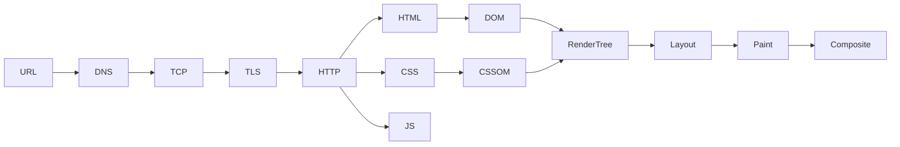
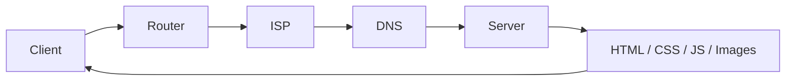
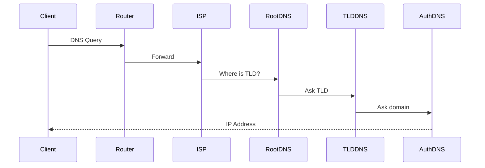
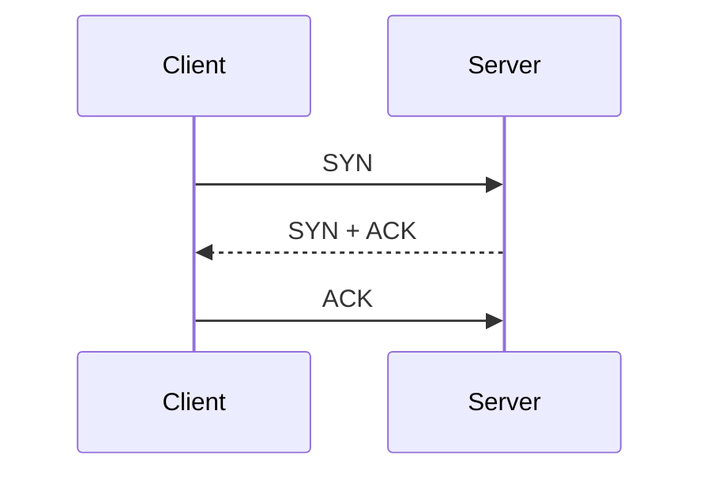
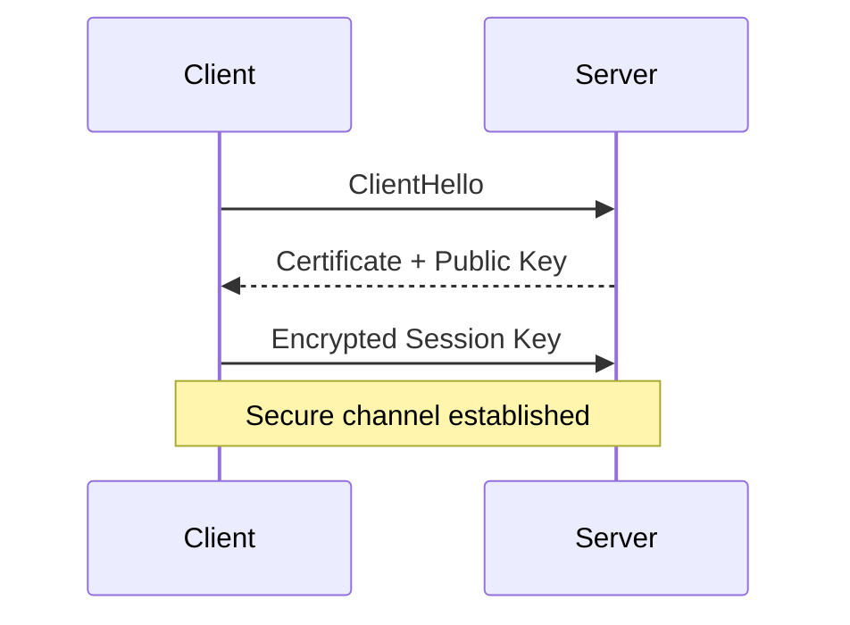
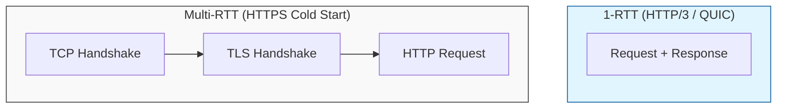
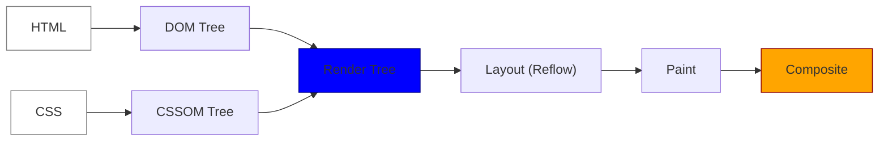
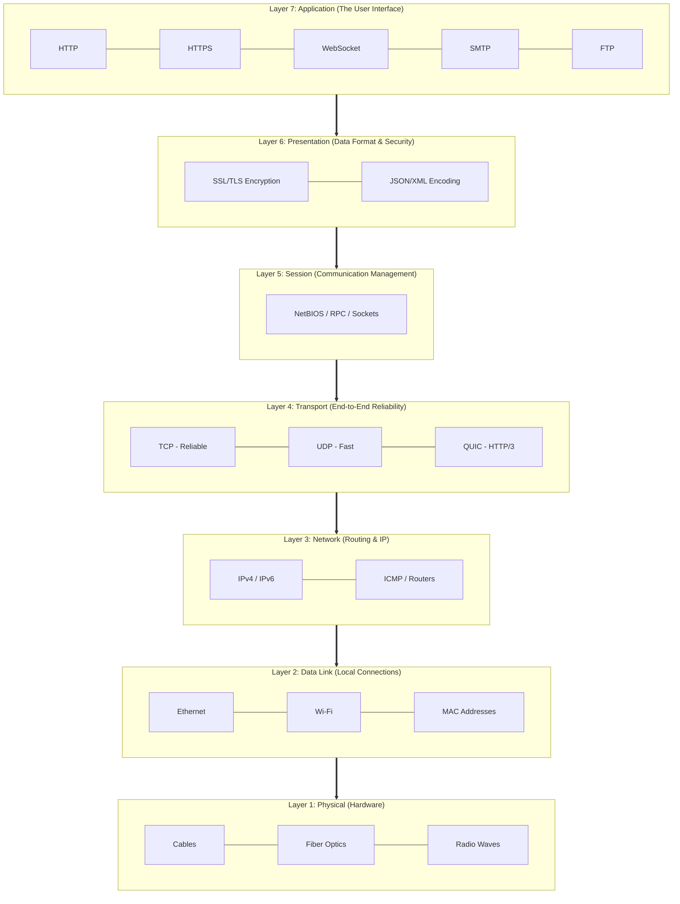

# How the Web Works: From URL to Pixels

> A clear, end‑to‑end mental model of what happens from **typing a URL** to **pixels on the screen**. This guide is structured progressively: beginners can focus on early sections, while advanced readers will appreciate the deep technical details and diagrams.

## Table of Contents

- [How the Web Works: From URL to Pixels](#how-the-web-works-from-url-to-pixels)
  - [Table of Contents](#table-of-contents)
  - [0. Big Picture](#0-big-picture)
  - [1. Understanding Domains \& URLs](#1-understanding-domains--urls)
    - [1.0 Full Forms](#10-full-forms)
    - [1.1 Domain hierarchy](#11-domain-hierarchy)
    - [1.2 Domain → IP](#12-domain--ip)
  - [2. What Happens When You Hit Enter](#2-what-happens-when-you-hit-enter)
    - [2.1 Browser Pre‑Checks (Before Network)](#21-browser-prechecks-before-network)
    - [2.2 Full Request Flow (High Level)](#22-full-request-flow-high-level)
    - [2.1 Pre‑request checks (very important)](#21-prerequest-checks-very-important)
  - [3. DNS Resolution (Name → IP)](#3-dns-resolution-name--ip)
    - [3.1 Domain → IP Mapping Authority](#31-domain--ip-mapping-authority)
    - [3.2 DNS lookup flow](#32-dns-lookup-flow)
    - [3.3 Peering (why Google is fast)](#33-peering-why-google-is-fast)
  - [4. Transport Layer (Connection Setup)](#4-transport-layer-connection-setup)
    - [4.1 TCP 3‑Way Handshake (Guaranteed Delivery)](#41-tcp-3way-handshake-guaranteed-delivery)
  - [5. Security Layer (TLS / SSL)](#5-security-layer-tls--ssl)
    - [5.1 Encryption / Decryption Flow (HTTPS)](#51-encryption--decryption-flow-https)
  - [6. HTTP Request \& Response](#6-http-request--response)
    - [6.1 Client → Server Data Flow](#61-client--server-data-flow)
    - [6.2 Browser Pre‑Request Checks](#62-browser-prerequest-checks)
    - [6.3 HTTP request](#63-http-request)
    - [6.4 Response streaming (important correction)](#64-response-streaming-important-correction)
  - [7. Browser Resource Scheduling](#7-browser-resource-scheduling)
    - [7.1 Parallel Network Requests](#71-parallel-network-requests)
    - [7.2 Parallel requests](#72-parallel-requests)
  - [8. HTML Parsing → DOM](#8-html-parsing--dom)
    - [8.1 Parsing HTML](#81-parsing-html)
  - [9. CSS Parsing → CSSOM](#9-css-parsing--cssom)
    - [9.1 CSSOM](#91-cssom)
    - [9.2 Blocking Rules](#92-blocking-rules)
  - [10. JavaScript Loading \& Execution](#10-javascript-loading--execution)
    - [10.1 Why JS blocks parsing](#101-why-js-blocks-parsing)
    - [10.2 Script attributes](#102-script-attributes)
  - [11. DOM + CSSOM → Render Tree](#11-dom--cssom--render-tree)
    - [11.1 Render Tree rules](#111-render-tree-rules)
  - [12. Layout (Reflow)](#12-layout-reflow)
    - [12.1 What layout does](#121-what-layout-does)
    - [12.2 What triggers reflow](#122-what-triggers-reflow)
  - [13. Paint](#13-paint)
  - [14. Compositing](#14-compositing)
  - [15. Performance Milestones](#15-performance-milestones)
  - [16. HTTP Versions Comparison](#16-http-versions-comparison)
  - [17. Peering \& ICANN](#17-peering--icann)
    - [17.1 Peering](#171-peering)
    - [17.2 ICANN \& WHOIS](#172-icann--whois)
  - [18. Complete Timeline (Condensed)](#18-complete-timeline-condensed)
  - [19. Key Mental Models](#19-key-mental-models)
  - [20. Advanced Tips](#20-advanced-tips)
  - [21. Final One‑Sentence Summary](#21-final-onesentence-summary)
  - [22. Big Picture Visualization](#22-big-picture-visualization)
  - [23. Browser Pre-Checks Visualization](#23-browser-pre-checks-visualization)
  - [24. Full Request Flow Visualization](#24-full-request-flow-visualization)
  - [25. DNS Resolution Visualization](#25-dns-resolution-visualization)
  - [26. TCP 3-Way Handshake Visualization](#26-tcp-3-way-handshake-visualization)
  - [27. TLS Handshake Visualization](#27-tls-handshake-visualization)
  - [28. 1-RTT vs Multi-RTT Visualization](#28-1-rtt-vs-multi-rtt-visualization)
  - [29. Critical Rendering Path Visualization](#29-critical-rendering-path-visualization)
  - [30. Web Protocol Comparison Diagram](#30-web-protocol-comparison-diagram)
    - [Detailed Breakdown of "How It Works"](#detailed-breakdown-of-how-it-works)
    - [Key Takeaways for Mental Model:](#key-takeaways-for-mental-model)
  - [The 7 OSI (Open Systems Interconnection) Layers (Brief Intro)](#the-7-osi-open-systems-interconnection-layers-brief-intro)
    - [Protocol to OSI Mapping](#protocol-to-osi-mapping)
    - [Why this matters for "How the Web Works":](#why-this-matters-for-how-the-web-works)
  - [31. Web Architecture Concepts for Advanced Readers](#31-web-architecture-concepts-for-advanced-readers)
    - [31.1 Client-Server Architecture](#311-client-server-architecture)
    - [31.2 Single Page Applications (SPAs)](#312-single-page-applications-spas)
    - [31.3 Server-Side Rendering (SSR) \& Static Site Generation (SSG)](#313-server-side-rendering-ssr--static-site-generation-ssg)
    - [31.4 Progressive Web Apps (PWAs)](#314-progressive-web-apps-pwas)
    - [31.5 Microservices \& APIs](#315-microservices--apis)
    - [31.6 Content Delivery Networks (CDNs)](#316-content-delivery-networks-cdns)
    - [31.7 Scalability Considerations](#317-scalability-considerations)
  - [References \& Further Reading](#references--further-reading)

---

**Reader Levels Guide:**

- **Beginner**: Focus on sections 0-7 for basic understanding of how the web works.
- **Intermediate**: Sections 8-15 for browser internals and rendering.
- **Advanced**: Sections 16+ for deep protocol details, optimizations, and visualizations.

---

## 0. Big Picture

**URL → DNS → TCP → TLS → HTTP → HTML/CSS/JS → DOM/CSSOM → Render Tree → Layout → Paint → Composite**

Keep this chain in your head.

---

## 1. Understanding Domains & URLs

**Beginner Note:** Domains are website names like 'google.com'. URLs are full addresses including 'https://'. This section explains the parts.

### 1.0 Full Forms

- **TLD** → **Top-Level Domain** (e.g. `.com`, `.org`, `.edu`, `.in`)
- **SLD** → **Second-Level Domain** (e.g. `google.com`, `microsoft.com`)
- **Third-Level Domain** → Commonly called **Subdomain** (e.g. `www.google.com`, `mail.google.com`)

### 1.1 Domain hierarchy

```
. (root)
└── TLD        → com, org, edu, gov, in, au
    └── SLD    → google.com, microsoft.com
        └── Subdomain → www.google.com, docs.google.com
```

- **Root (.)**: implicit, never typed
- **TLD**: managed by registries (via ICANN)
- **SLD**: what companies buy
- **Subdomain**: logical routing (www, api, cdn)

### 1.2 Domain → IP

- Human‑readable → machine‑readable
- Example:

```
www.google.com → 142.250.198.78 (IPv4)
```

> Mapping governed by **ICANN**, registrars, and DNS infrastructure.

---

## 2. What Happens When You Hit Enter

### 2.1 Browser Pre‑Checks (Before Network)

The client checks **before hitting the router**:

1. Browser **Memory / Disk Cache**
2. **Service Worker cache**
3. **OS‑level DNS cache**

If found → **network request is skipped**

---

### 2.2 Full Request Flow (High Level)

```
Client
 → Router
   → ISP
     → DNS
       → Server
         → HTML / CSS / JS / Images
           ← streamed back to client
```

### 2.1 Pre‑request checks (very important)

Before any network call:

1. **Browser cache** (memory / disk)
2. **Service Worker cache** (if registered)
3. **OS‑level DNS cache**

If found → **network is skipped entirely**.

---

## 3. DNS Resolution (Name → IP)

**Intermediate Note:** DNS translates human-readable names to machine IPs. It's like looking up a phone number from a name.

### 3.1 Domain → IP Mapping Authority

- Domain ↔ IP guidelines governed by **ICANN**
- Registrars & ISPs must follow ICANN policies
- **WHOIS** exposes domain metadata
- **WHOIS Privacy Protection** hides owner identity

### 3.2 DNS lookup flow

```
Browser
 → Router
   → ISP resolver
     → Root DNS
       → TLD DNS (.com)
         → Authoritative DNS (google.com)
```

- Result is cached at multiple layers
- TTL controls cache lifetime

### 3.3 Peering (why Google is fast)

- **Peering** = fewer network hops
- Google, Cloudflare, Meta peer directly with ISPs
- Result: lower latency, faster TTFB

---

## 4. Transport Layer (Connection Setup)

### 4.1 TCP 3‑Way Handshake (Guaranteed Delivery)

```
Client  →  SYN
Server  →  SYN + ACK
Client  →  ACK
```

Purpose:

- Confirms both sides are reachable
- Establishes sequence numbers
- Enables retransmission & ordering

> Used by **HTTP/1.1**, **HTTP/2**, **HTTPS**, **WebSocket**

---

## 5. Security Layer (TLS / SSL)

### 5.1 Encryption / Decryption Flow (HTTPS)

1. Client sends **ClientHello**
2. Server responds with **certificate + public key**
3. Client verifies certificate (CA chain)
4. Client generates **session key**
5. Session key encrypted using server public key
6. Server decrypts using private key

After this:

- All data uses **symmetric encryption** (fast)
- No one can read packets in transit

> TLS happens **after TCP**, before HTTP data

---

## 6. HTTP Request & Response

### 6.1 Client → Server Data Flow

```
Client
 → Router
   → ISP
     → DNS
       → Server
         → HTML / CSS / JS / Images
           ← streamed back to client
```

### 6.2 Browser Pre‑Request Checks

Before hitting the network:

- Browser **Memory Cache / Disk Cache**
- **Service Worker cache** (if present)
- **OS‑level DNS cache**

If found → **network call skipped**

### 6.3 HTTP request

```
GET /index.html HTTP/1.1
Host: example.com
```

### 6.4 Response streaming (important correction)

- Data is **not fixed to 14kb / 28kb / 56kb**
- Chunking depends on:
  - TCP Congestion Window (cwnd)
  - RTT (Round-Trip Time)
  - OS TCP stack tuning
  - Browser networking implementation
  - Lower RTT = faster page loads

Correct mental model:

> **Data streams progressively, size is adaptive.**

---

## 7. Browser Resource Scheduling

### 7.1 Parallel Network Requests

- Browsers allow **~6–8 parallel connections per origin**
- Extra requests are **queued**

You can inspect this at:

```
DevTools → Network → Timing → Queueing
```

This delay appears as **Resource Scheduling Queueing**

### 7.2 Parallel requests

- Browsers allow ~**6–8 parallel connections per origin**
- Excess requests are **queued**

You can see this in:

```
DevTools → Network → Timing → Queueing
```

---

## 8. HTML Parsing → DOM

### 8.1 Parsing HTML

- HTML is parsed **top‑down**
- Tokens → Nodes → **DOM Tree**

```
html
 ├── head
 │    ├── link
 │    └── script
 └── body
      └── div
           └── p
```

---

## 9. CSS Parsing → CSSOM

### 9.1 CSSOM

- CSS is parsed into **CSSOM**
- Represents computed styles

### 9.2 Blocking Rules

- **CSS is Render‑Blocking**

  - Browser cannot paint pixels without final styles
  - Render tree waits for CSSOM

- **JavaScript is Parser‑Blocking**

  - JS can modify DOM/CSSOM
  - HTML parsing pauses until JS executes
  - Exceptions:

    - `defer` → runs after DOM is parsed
    - `async` → runs as soon as downloaded (race)

- Browser **cannot paint without styles**

- Hence: **CSS = render‑blocking**

---

## 10. JavaScript Loading & Execution

### 10.1 Why JS blocks parsing

- JS can mutate DOM
- Browser must pause parsing to execute

### 10.2 Script attributes

| Type   | Parser       | Execution        |
| ------ | ------------ | ---------------- |
| normal | blocks       | immediate        |
| defer  | non‑blocking | after DOM parsed |
| async  | non‑blocking | ASAP (race)      |

Golden rule:

> **Use `defer` for almost all scripts.**

---

## 11. DOM + CSSOM → Render Tree

### 11.1 Render Tree rules

Included:

- Visible DOM nodes
- Computed styles

Excluded:

- `display: none`
- `<head>` elements

> DOM ≠ Render Tree

---

## 12. Layout (Reflow)

### 12.1 What layout does

- Calculates:

  - width / height
  - position
  - box model

### 12.2 What triggers reflow

- Changing:

  - width / height
  - position / float
  - font size

Reflow is **expensive**.

---

## 13. Paint

- Converts boxes → pixels
- Text, colors, borders, shadows

Changing these triggers **repaint only**:

- color
- background
- visibility

---

## 14. Compositing

- Layers sent to GPU
- Transforms & opacity handled here

Best for animations:

```
transform
opacity
```

---

## 15. Performance Milestones

| Metric | Meaning               |
| ------ | --------------------- |
| FCP    | First content painted |
| DCL    | DOM ready             |
| LCP    | Largest content       |
| TTI    | Page usable           |

**Beginner Note:** These are key points in loading a webpage. FCP is when you first see something on screen.
**Advanced Note:** Use Chrome DevTools or Web Vitals to measure these. Aim for LCP under 2.5s for good UX.

---

## 16. HTTP Versions Comparison

| Feature               | HTTP/1.1 | HTTP/2               | HTTP/3     |
| --------------------- | -------- | -------------------- | ---------- |
| Transport             | TCP      | TCP                  | UDP (QUIC) |
| Head‑of‑Line Blocking | Yes      | Fixed (multiplexing) | No         |
| Multiplexing          | ❌       | ✅                   | ✅         |
| TLS Required          | ❌       | ❌                   | ✅         |
| Mobile Friendly       | ❌       | ⚠️                   | ✅         |

**Advanced Note:** HTTP/3 uses QUIC over UDP for faster, more reliable connections, especially on unstable networks like mobile.

---

## 17. Peering & ICANN

### 17.1 Peering

- Direct ISP ↔ provider connections
- Fewer hops = lower latency
- Google, Cloudflare excel at peering

### 17.2 ICANN & WHOIS

- **ICANN** governs domain ↔ IP mapping rules
- WHOIS privacy hides owner details
- ISPs & registrars follow ICANN policies

---

## 18. Complete Timeline (Condensed)

```
Request page
 → DNS
 → TCP
 → TLS
 → HTTP
 → HTML
 → DOM
 → CSSOM
 → JS
 → Render Tree
 → Layout
 → Paint
 → Composite
```

---

## 19. Key Mental Models

- **HTML builds DOM**
- **CSS builds CSSOM**
- **DOM + CSSOM = Render Tree**
- **JS blocks parser (unless defer/async)**
- **CSS blocks rendering**
- **Layout is expensive, paint is cheaper**
- **Transform/opacity are GPU‑friendly**
- **Critical Rendering Path (CRP)** = Render Tree → Layout → Paint → Composite

---

## 20. Advanced Tips

- Inline critical CSS
- Defer non‑critical JS
- Reduce DOM size
- Avoid layout thrashing
- Use HTTP/2 or HTTP/3
- Prefer CDN + peering

---

## 21. Final One‑Sentence Summary

> The web is a carefully staged pipeline where **networking latency, parsing order, and rendering cost** decide how fast users see pixels.

**All Levels:** This summary captures the essence – optimize each step for better performance!

---

## 22. Big Picture Visualization



**Beginner Friendly:** This diagram shows how browsers try to avoid slow network requests by checking local caches first.

---

## 23. Browser Pre-Checks Visualization


**Takeaway:** network is last resort.

---

## 24. Full Request Flow Visualization



**Intermediate:** This sequence shows the hierarchical DNS query process, from local to authoritative servers.

---

## 25. DNS Resolution Visualization



---

## 26. TCP 3-Way Handshake Visualization



**RTT cost:** 1 RTT
**Advanced Note:** The handshake establishes encrypted communication securely.

---

## 27. TLS Handshake Visualization



---

## 28. 1-RTT vs Multi-RTT Visualization



---

## 29. Critical Rendering Path Visualization



**Advanced:** This class diagram compares web protocols and their OSI layer mappings.

---

## 30. Web Protocol Comparison Diagram


---

### Detailed Breakdown of "How It Works"

| Protocol      | How It Works (Step-by-Step)                     | Advanced Technical Detail                                                           |
| :------------ | :---------------------------------------------- | :---------------------------------------------------------------------------------- |
| **HTTP**      | `TCP Connection` ➔ `Request` ➔ `Response`       | **Stateless:** Each request is independent; uses Cookies/Sessions for state.        |
| **HTTP/3**    | `UDP Connection` ➔ `QUIC Handshake` ➔ `Streams` | **Zero-RTT:** Reconnecting to a known server requires 0 round trips.                |
| **HTTPS**     | `TCP` ➔ `Certificate Verify` ➔ `Key Exchange`   | **PFS:** Uses _Perfect Forward Secrecy_ so old leaked keys can't decrypt past data. |
| **WebSocket** | `HTTP GET + Upgrade Header` ➔ `101 Switching`   | **Persistent:** Stays open indefinitely until one side closes it.                   |
| **TCP**       | `SYN` ➔ `SYN + ACK` ➔ `ACK`                     | **Congestion Control:** Automatically slows down if the network is busy.            |
| **UDP**       | `Source IP/Port` ➔ `Target IP/Port`             | **Check-sum only:** No delivery guarantee; packets can arrive out of order.         |
| **SMTP**      | `HELO/EHLO` ➔ `MAIL FROM` ➔ `RCPT TO`           | **Relay:** Designed to jump between servers until it reaches the destination.       |
| **FTP**       | `Auth on Port 21` ➔ `Transfer on Port 20`       | **Active vs Passive:** Can be blocked by firewalls depending on the mode.           |

### Key Takeaways for Mental Model:

1.  **Transport is the Foundation:** All "Application" protocols (HTTP, SMTP, FTP) must choose between **TCP** (Reliable/Slow) or **UDP** (Fast/Unreliable).
2.  **The "Nonce" connection:** In HTTPS (and Web security like CSP), **Nonces** are random numbers used to ensure that a cryptographic session or a script tag is unique and cannot be replayed by a hacker.
3.  **HTTP/3 is the Future:** By moving to UDP (QUIC), it fixes the "Head-of-Line Blocking" problem where one slow packet used to freeze the entire website load.

## The 7 OSI (Open Systems Interconnection) Layers (Brief Intro)

- **Layer 7: Application** – The "Interface" (What you see: HTTP, WebSocket, SMTP).
- **Layer 6: Presentation** – The "Translator" (Encryption/SSL, Compression).
- **Layer 5: Session** – The "Manager" (Starts/Stops conversations).
- **Layer 4: Transport** – The "Courier" (Reliable TCP vs. Fast UDP).
- **Layer 3: Network** – The "Navigator" (IP addresses and Routing).
- **Layer 2: Data Link** – The "Bridge" (Local hardware, MAC addresses).
- **Layer 1: Physical** – The "Wire" (Electrical signals, cables, bits).

---

### Protocol to OSI Mapping



### Why this matters for "How the Web Works":

1.  **Top-Down Execution:** When you type a URL, the data starts at **L7 (HTTP)**, gets encrypted at **L6 (TLS)**, and is broken into segments at **L4 (TCP)** before traveling down the physical wire.
2.  **Troubleshooting:** If your "Internet is down," it's usually **L1 or L2** (cable unplugged). If the "Website is slow," it's usually **L4 (TCP Congestion)** or **L7 (Heavy JS code)**.
3.  **Encapsulation:** Every layer adds its own "header" (metadata) to the data packet as it moves down. When it reaches the server, the server peels these headers off one by one (Decapsulation) to see the original request.

---

## 31. Web Architecture Concepts for Advanced Readers

**Advanced Note:** This section bridges the technical pipeline with high-level web architectures, catering to architects and engineers designing scalable systems.

### 31.1 Client-Server Architecture

- **Traditional Model:** Browser (client) requests resources from server. Server responds with HTML/CSS/JS.
- **Evolution:** From static sites to dynamic apps using APIs (REST, GraphQL).

### 31.2 Single Page Applications (SPAs)

- **How It Works:** Initial load fetches a shell; subsequent navigation updates DOM via JS (e.g., React, Vue).
- **Pros:** Fast interactions, rich UX.
- **Cons:** SEO challenges, initial load time. Mitigate with SSR/SSG.

### 31.3 Server-Side Rendering (SSR) & Static Site Generation (SSG)

- **SSR:** Server renders HTML on each request (e.g., Next.js, Nuxt).
- **SSG:** Pre-renders at build time for static hosting (e.g., Gatsby).
- **Benefits:** Better SEO, faster perceived load.

### 31.4 Progressive Web Apps (PWAs)

- **Features:** Offline support via Service Workers, installable, push notifications.
- **Architecture:** Combines web standards with app-like experiences.

### 31.5 Microservices & APIs

- **Decoupled Services:** Backend split into independent services communicating via APIs.
- **Web Impact:** Faster deployments, but adds complexity in networking (e.g., API gateways, load balancers).

### 31.6 Content Delivery Networks (CDNs)

- **Role:** Distribute content globally to reduce latency (e.g., Cloudflare, Akamai).
- **Integration:** Cache static assets, edge computing for dynamic content.

### 31.7 Scalability Considerations

- **Horizontal Scaling:** Load balancers distribute traffic.
- **Caching Layers:** Browser → CDN → Server → Database.
- **Monitoring:** Use tools like Web Vitals for performance metrics.

**Key Takeaway for Architects:** The web's pipeline (DNS → TCP → HTTP → Render) must align with architecture choices. For global apps, prioritize CDNs and HTTP/3; for interactive apps, optimize CRP and JS bundles.

---

## References & Further Reading

- **General Web Fundamentals**
  - MDN Web Docs: [How the Web Works](https://developer.mozilla.org/en-US/docs/Learn/Getting_started_with_the_web/How_the_Web_works)
  - Web.dev: [Critical Rendering Path](https://web.dev/critical-rendering-path/)
  - "Eloquent JavaScript" by Marijn Haverbeke (for JS basics)
- **Networking & Protocols**
  - HTTP/3 Spec: [QUIC Protocol](https://quicwg.org/)
  - RFC 9114: [HTTP/3](https://tools.ietf.org/html/rfc9114)
  - "Computer Networking: A Top-Down Approach" by Kurose & Ross
- **Browser Internals & Performance**
  - "High Performance Browser Networking" by Ilya Grigorik
  - Google Developers: [Rendering Performance](https://developers.google.com/web/fundamentals/performance/rendering)
  - Web.dev: [Web Vitals](https://atulkawasthi.medium.com/react-performance-hacks-make-your-front-end-fly-dca5ab722158)
- **Security**
  - OWASP: [Transport Layer Security](https://cheatsheetseries.owasp.org/cheatsheets/Transport_Layer_Security_Cheat_Sheet.html)
  - "Bulletproof SSL and TLS" by Ivan Ristić
- **Architecture & Best Practices**
  - Martin Fowler: [Microservices](https://martinfowler.com/microservices/)
  - "Designing Data-Intensive Applications" by Martin Kleppmann
  - Web.dev: [Progressive Web Apps](https://web.dev/progressive-web-apps/)
