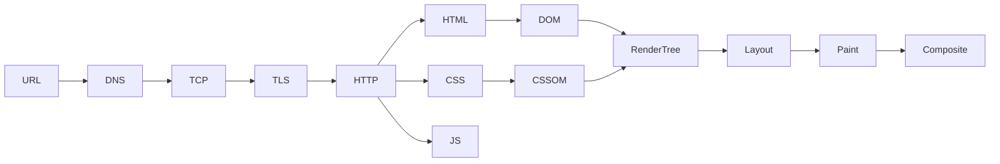
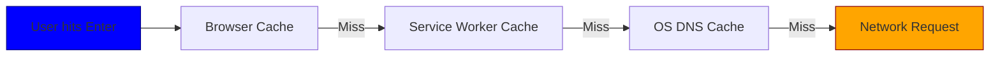
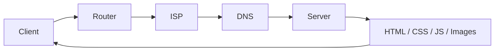
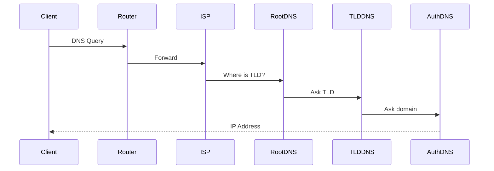
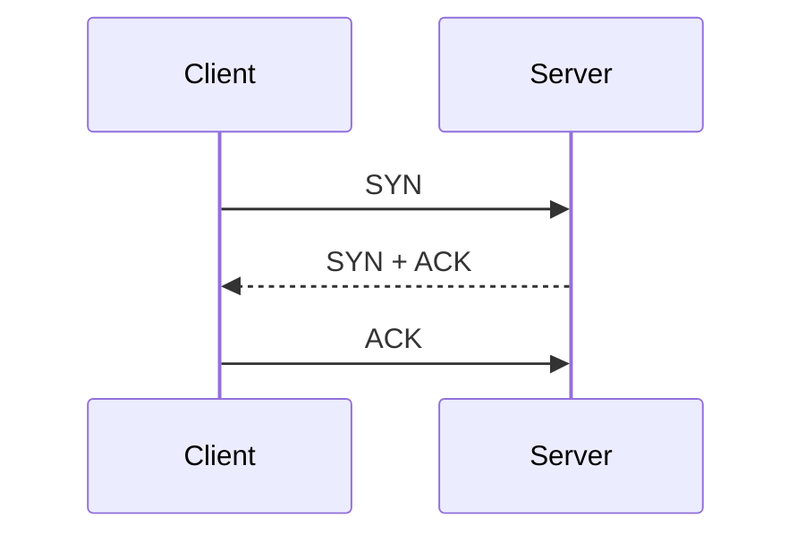
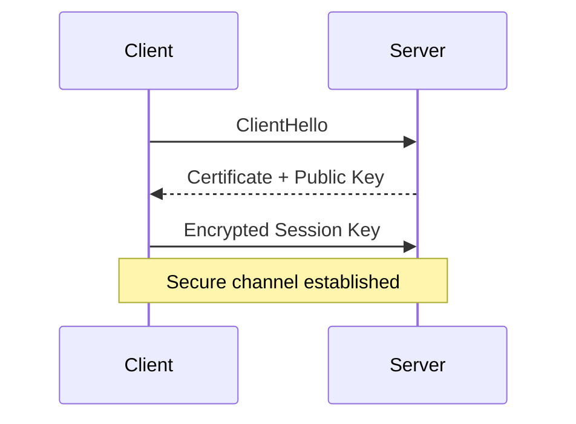
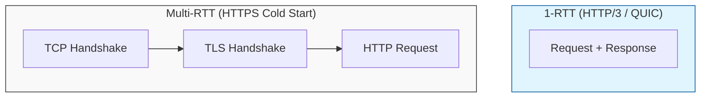
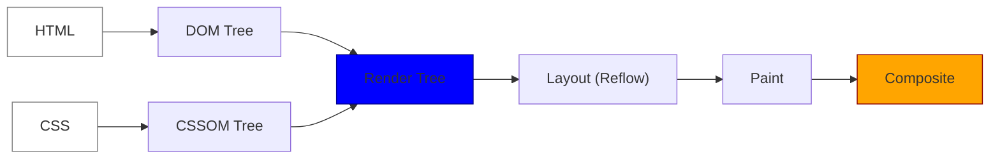
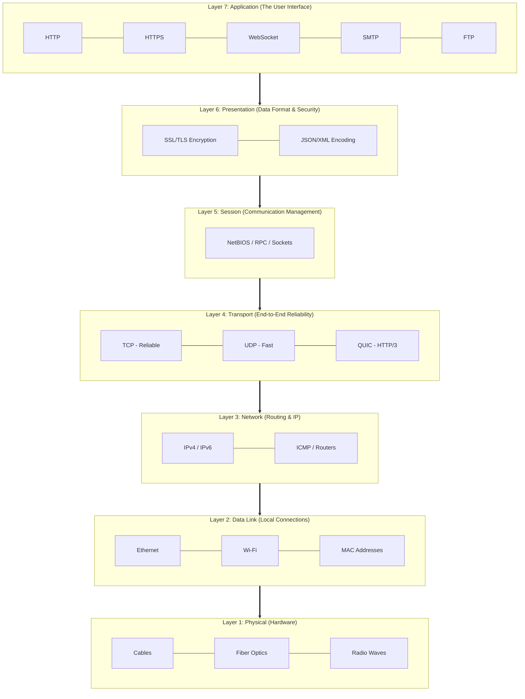

# How the Web Works

> A clear, end‑to‑end mental model of what happens from **typing a URL** to **pixels on the screen**.

---

## 0. Big Picture

**URL → DNS → TCP → TLS → HTTP → HTML/CSS/JS → DOM/CSSOM → Render Tree → Layout → Paint → Composite**

Keep this chain in your head.

---

## 1. Understanding Domains & URLs

### 1.0 Full Forms

- **TLD** → **Top-Level Domain** (e.g. `.com`, `.org`, `.edu`, `.in`)
- **SLD** → **Second-Level Domain** (e.g. `google.com`, `microsoft.com`)
- **Third-Level Domain** → Commonly called **Subdomain** (e.g. `www.google.com`, `mail.google.com`)

### 1.1 Domain hierarchy

```
. (root)
└── TLD        → com, org, edu, gov, in, au
    └── SLD    → google.com, microsoft.com
        └── Subdomain → www.google.com, docs.google.com
```

- **Root (.)**: implicit, never typed
- **TLD**: managed by registries (via ICANN)
- **SLD**: what companies buy
- **Subdomain**: logical routing (www, api, cdn)

### 1.2 Domain → IP

- Human‑readable → machine‑readable
- Example:

```
www.google.com → 142.250.198.78 (IPv4)
```

> Mapping governed by **ICANN**, registrars, and DNS infrastructure.

---

## 2. What Happens When You Hit Enter

### 2.1 Browser Pre‑Checks (Before Network)

The client checks **before hitting the router**:

1. Browser **Memory / Disk Cache**
2. **Service Worker cache**
3. **OS‑level DNS cache**

If found → **network request is skipped**

---

### 2.2 Full Request Flow (High Level)

```
Client
 → Router
   → ISP
     → DNS
       → Server
         → HTML / CSS / JS / Images
           ← streamed back to client
```

### 2.1 Pre‑request checks (very important)

Before any network call:

1. **Browser cache** (memory / disk)
2. **Service Worker cache** (if registered)
3. **OS‑level DNS cache**

If found → **network is skipped entirely**.

---

## 3. DNS Resolution (Name → IP)

### 3.1 Domain → IP Mapping Authority

- Domain ↔ IP guidelines governed by **ICANN**
- Registrars & ISPs must follow ICANN policies
- **WHOIS** exposes domain metadata
- **WHOIS Privacy Protection** hides owner identity

### 3.2 DNS lookup flow

```
Browser
 → Router
   → ISP resolver
     → Root DNS
       → TLD DNS (.com)
         → Authoritative DNS (google.com)
```

- Result is cached at multiple layers
- TTL controls cache lifetime

### 3.3 Peering (why Google is fast)

- **Peering** = fewer network hops
- Google, Cloudflare, Meta peer directly with ISPs
- Result: lower latency, faster TTFB

---

## 4. Transport Layer (Connection Setup)

### 4.1 TCP 3‑Way Handshake (Guaranteed Delivery)

```
Client  →  SYN
Server  →  SYN + ACK
Client  →  ACK
```

Purpose:

- Confirms both sides are reachable
- Establishes sequence numbers
- Enables retransmission & ordering

> Used by **HTTP/1.1**, **HTTP/2**, **HTTPS**, **WebSocket**

---

## 5. Security Layer (TLS / SSL)

### 5.1 Encryption / Decryption Flow (HTTPS)

1. Client sends **ClientHello**
2. Server responds with **certificate + public key**
3. Client verifies certificate (CA chain)
4. Client generates **session key**
5. Session key encrypted using server public key
6. Server decrypts using private key

After this:

- All data uses **symmetric encryption** (fast)
- No one can read packets in transit

> TLS happens **after TCP**, before HTTP data

---

## 6. HTTP Request & Response

### 6.1 Client → Server Data Flow

```
Client
 → Router
   → ISP
     → DNS
       → Server
         → HTML / CSS / JS / Images
           ← streamed back to client
```

### 6.2 Browser Pre‑Request Checks

Before hitting the network:

- Browser **Memory Cache / Disk Cache**
- **Service Worker cache** (if present)
- **OS‑level DNS cache**

If found → **network call skipped**

### 6.3 HTTP request

```
GET /index.html HTTP/1.1
Host: example.com
```

### 6.4 Response streaming (important correction)

- Data is **not fixed to 14kb / 28kb / 56kb**
- Chunking depends on:
  - TCP Congestion Window (cwnd)
  - RTT (Round-Trip Time)
  - OS TCP stack tuning
  - Browser networking implementation
  - Lower RTT = faster page loads

Correct mental model:

> **Data streams progressively, size is adaptive.**

---

## 7. Browser Resource Scheduling

### 7.1 Parallel Network Requests

- Browsers allow **~6–8 parallel connections per origin**
- Extra requests are **queued**

You can inspect this at:

```
DevTools → Network → Timing → Queueing
```

This delay appears as **Resource Scheduling Queueing**

### 7.2 Parallel requests

- Browsers allow ~**6–8 parallel connections per origin**
- Excess requests are **queued**

You can see this in:

```
DevTools → Network → Timing → Queueing
```

---

## 8. HTML Parsing → DOM

### 8.1 Parsing HTML

- HTML is parsed **top‑down**
- Tokens → Nodes → **DOM Tree**

```
html
 ├── head
 │    ├── link
 │    └── script
 └── body
      └── div
           └── p
```

---

## 9. CSS Parsing → CSSOM

### 9.1 CSSOM

- CSS is parsed into **CSSOM**
- Represents computed styles

### 9.2 Blocking Rules

- **CSS is Render‑Blocking**

  - Browser cannot paint pixels without final styles
  - Render tree waits for CSSOM

- **JavaScript is Parser‑Blocking**

  - JS can modify DOM/CSSOM
  - HTML parsing pauses until JS executes
  - Exceptions:

    - `defer` → runs after DOM is parsed
    - `async` → runs as soon as downloaded (race)

- Browser **cannot paint without styles**

- Hence: **CSS = render‑blocking**

---

## 10. JavaScript Loading & Execution

### 10.1 Why JS blocks parsing

- JS can mutate DOM
- Browser must pause parsing to execute

### 10.2 Script attributes

| Type   | Parser       | Execution        |
| ------ | ------------ | ---------------- |
| normal | blocks       | immediate        |
| defer  | non‑blocking | after DOM parsed |
| async  | non‑blocking | ASAP (race)      |

Golden rule:

> **Use `defer` for almost all scripts.**

---

## 11. DOM + CSSOM → Render Tree

### 11.1 Render Tree rules

Included:

- Visible DOM nodes
- Computed styles

Excluded:

- `display: none`
- `<head>` elements

> DOM ≠ Render Tree

---

## 12. Layout (Reflow)

### 12.1 What layout does

- Calculates:

  - width / height
  - position
  - box model

### 12.2 What triggers reflow

- Changing:

  - width / height
  - position / float
  - font size

Reflow is **expensive**.

---

## 13. Paint

- Converts boxes → pixels
- Text, colors, borders, shadows

Changing these triggers **repaint only**:

- color
- background
- visibility

---

## 14. Compositing

- Layers sent to GPU
- Transforms & opacity handled here

Best for animations:

```
transform
opacity
```

---

## 15. Performance Milestones

| Metric | Meaning               |
| ------ | --------------------- |
| FCP    | First content painted |
| DCL    | DOM ready             |
| LCP    | Largest content       |
| TTI    | Page usable           |

---

## 16. HTTP Versions Comparison

| Feature               | HTTP/1.1 | HTTP/2               | HTTP/3     |
| --------------------- | -------- | -------------------- | ---------- |
| Transport             | TCP      | TCP                  | UDP (QUIC) |
| Head‑of‑Line Blocking | Yes      | Fixed (multiplexing) | No         |
| Multiplexing          | ❌       | ✅                   | ✅         |
| TLS Required          | ❌       | ❌                   | ✅         |
| Mobile Friendly       | ❌       | ⚠️                   | ✅         |

---

## 17. Peering & ICANN

### 17.1 Peering

- Direct ISP ↔ provider connections
- Fewer hops = lower latency
- Google, Cloudflare excel at peering

### 17.2 ICANN & WHOIS

- **ICANN** governs domain ↔ IP mapping rules
- WHOIS privacy hides owner details
- ISPs & registrars follow ICANN policies

---

## 18. Complete Timeline (Condensed)

```
Request page
 → DNS
 → TCP
 → TLS
 → HTTP
 → HTML
 → DOM
 → CSSOM
 → JS
 → Render Tree
 → Layout
 → Paint
 → Composite
```

---

## 17. Key Mental Models

- **HTML builds DOM**
- **CSS builds CSSOM**
- **DOM + CSSOM = Render Tree**
- **JS blocks parser (unless defer/async)**
- **CSS blocks rendering**
- **Layout is expensive, paint is cheaper**
- **Transform/opacity are GPU‑friendly**
- **Critical Rendering Path (CRP)** = Render Tree → Layout → Paint → Composite

---

## 18. Advanced Tips

- Inline critical CSS
- Defer non‑critical JS
- Reduce DOM size
- Avoid layout thrashing
- Use HTTP/2 or HTTP/3
- Prefer CDN + peering

---

## 19. Final One‑Sentence Summary

> The web is a carefully staged pipeline where **networking latency, parsing order, and rendering cost** decide how fast users see pixels.

---

## 1. Big Picture



---

## 2. Browser Pre-Checks



**Takeaway:** network is last resort.

---

## 3. Full Request Flow



---

## 4. DNS Resolution



---

## 5. TCP 3-Way Handshake



**RTT cost:** 1 RTT

---

## 6. TLS Handshake



---

## 7. 1-RTT vs Multi-RTT



---

## 8. Critical Rendering Path



---

## Web Protocol Comparison Diagram

```mermaid
classDiagram
    class Protocol {
        <<Interface>>
        +String Layer
        +String Transport
        +String Port
        +HowItWorks()
        +UseCases()
    }

    class HTTP {
        +Layer: 7 (Application)
        +Transport: TCP
        +Port: 80
        +Mechanism: Stateless Request/Response
        +UseCases: Web Browsing, REST APIs
    }

    class HTTPS {
        +Layer: 7 (Application)
        +Transport: TCP + TLS/SSL
        +Port: 443
        +Mechanism: TCP Handshake -> TLS Handshake (Public Key -> Session Key)
        +UseCases: Secure Banking, E-commerce
    }

    class HTTP3_QUIC {
        +Layer: 7 / 4 Hybrid
        +Transport: UDP
        +Port: 443
        +Mechanism: 0-RTT Handshake, Multiplexing (No Head-of-Line Blocking)
        +UseCases: VR/AR, IoT, High-speed Web
    }

    class WebSocket {
        +Layer: 7 (Application)
        +Transport: TCP
        +Port: 80/443
        +Mechanism: HTTP Upgrade -> Persistent Full-Duplex
        +UseCases: Live Chat, Real-time Trading, Gaming
    }

    class TCP {
        +Layer: 4 (Transport)
        +Mechanism: 3-Way Handshake (SYN -> SYN+ACK -> ACK)
        +Features: Reliable, Ordered delivery, Retransmission
        +UseCases: Email, Web, File Transfer
    }

    class UDP {
        +Layer: 4 (Transport)
        +Mechanism: Fire-and-Forget (No Handshake)
        +Features: Low Latency, Unreliable, Fast
        +UseCases: Video Calls, Streaming, Gaming
    }

    class SMTP {
        +Layer: 7 (Application)
        +Transport: TCP
        +Port: 25, 587
        +Mechanism: Push Protocol (Sender -> SMTP Server -> Receiver)
        +UseCases: Sending Emails
    }

    class FTP {
        +Layer: 7 (Application)
        +Transport: TCP
        +Port: 21 (Control), 20 (Data)
        +Mechanism: Dual-Channel (Control vs Data)
        +UseCases: Uploading/Downloading large files
    }

    HTTP --|> Protocol
    HTTPS --|> Protocol
    HTTP3_QUIC --|> Protocol
    WebSocket --|> Protocol
    TCP --|> Protocol
    UDP --|> Protocol
    SMTP --|> Protocol
    FTP --|> Protocol

```



---

### Detailed Breakdown of "How It Works"

| Protocol      | How It Works (Step-by-Step)                     | Advanced Technical Detail                                                           |
| :------------ | :---------------------------------------------- | :---------------------------------------------------------------------------------- |
| **HTTP**      | `TCP Connection` ➔ `Request` ➔ `Response`       | **Stateless:** Each request is independent; uses Cookies/Sessions for state.        |
| **HTTP/3**    | `UDP Connection` ➔ `QUIC Handshake` ➔ `Streams` | **Zero-RTT:** Reconnecting to a known server requires 0 round trips.                |
| **HTTPS**     | `TCP` ➔ `Certificate Verify` ➔ `Key Exchange`   | **PFS:** Uses _Perfect Forward Secrecy_ so old leaked keys can't decrypt past data. |
| **WebSocket** | `HTTP GET + Upgrade Header` ➔ `101 Switching`   | **Persistent:** Stays open indefinitely until one side closes it.                   |
| **TCP**       | `SYN` ➔ `SYN + ACK` ➔ `ACK`                     | **Congestion Control:** Automatically slows down if the network is busy.            |
| **UDP**       | `Source IP/Port` ➔ `Target IP/Port`             | **Check-sum only:** No delivery guarantee; packets can arrive out of order.         |
| **SMTP**      | `HELO/EHLO` ➔ `MAIL FROM` ➔ `RCPT TO`           | **Relay:** Designed to jump between servers until it reaches the destination.       |
| **FTP**       | `Auth on Port 21` ➔ `Transfer on Port 20`       | **Active vs Passive:** Can be blocked by firewalls depending on the mode.           |

### Key Takeaways for Mental Model:

1.  **Transport is the Foundation:** All "Application" protocols (HTTP, SMTP, FTP) must choose between **TCP** (Reliable/Slow) or **UDP** (Fast/Unreliable).
2.  **The "Nonce" connection:** In HTTPS (and Web security like CSP), **Nonces** are random numbers used to ensure that a cryptographic session or a script tag is unique and cannot be replayed by a hacker.
3.  **HTTP/3 is the Future:** By moving to UDP (QUIC), it fixes the "Head-of-Line Blocking" problem where one slow packet used to freeze the entire website load.

## The 7 OSI (Open Systems Interconnection) Layers (Brief Intro)

- **Layer 7: Application** – The "Interface" (What you see: HTTP, WebSocket, SMTP).
- **Layer 6: Presentation** – The "Translator" (Encryption/SSL, Compression).
- **Layer 5: Session** – The "Manager" (Starts/Stops conversations).
- **Layer 4: Transport** – The "Courier" (Reliable TCP vs. Fast UDP).
- **Layer 3: Network** – The "Navigator" (IP addresses and Routing).
- **Layer 2: Data Link** – The "Bridge" (Local hardware, MAC addresses).
- **Layer 1: Physical** – The "Wire" (Electrical signals, cables, bits).

---

### Protocol to OSI Mapping



### Why this matters for "How the Web Works":

1.  **Top-Down Execution:** When you type a URL, the data starts at **L7 (HTTP)**, gets encrypted at **L6 (TLS)**, and is broken into segments at **L4 (TCP)** before traveling down the physical wire.
2.  **Troubleshooting:** If your "Internet is down," it's usually **L1 or L2** (cable unplugged). If the "Website is slow," it's usually **L4 (TCP Congestion)** or **L7 (Heavy JS code)**.
3.  **Encapsulation:** Every layer adds its own "header" (metadata) to the data packet as it moves down. When it reaches the server, the server peels these headers off one by one (Decapsulation) to see the original request.
