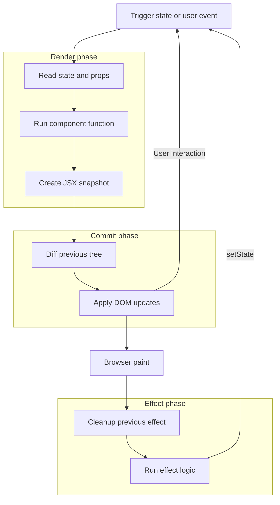
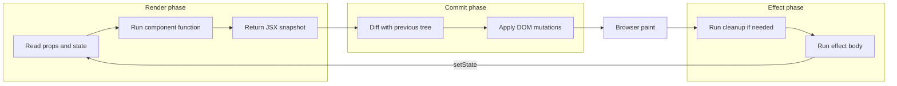
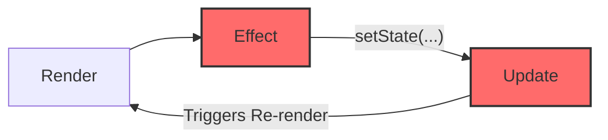

# ⚛️ The React Mental Model: A Comprehensive Guide

React is a library for building user interfaces based on a **declarative approach**: you describe _what_ you want, and React handles _how_ to update the DOM.

## ✨ Core Principles

- **Component-Based:** UIs are built from isolated, reusable components that manage their own state.
- **JSX:** An HTML-like syntax extension for JavaScript that makes describing UI intuitive and powerful.
- **Unidirectional Data Flow:** Data flows via `props` (parent to child) and `state` (internal to component). Changes trigger React's update process.

### React's High-Level Flow

- **State change?** → Render → Commit → Paint → Effects
- **No state change?** → UI unchanged
- **Events (user-driven)** → update state → trigger pipeline
- **Effects (React-driven)** → run after DOM update

---

## 🗺️ The Core Loop

Everything in React follows this cycle. Understanding this flow is the key to debugging and building effectively.



---



---

- Render → pure calculation, no side effects
- Commit → DOM updates happen
- Paint → browser shows UI
- Effect → side effects run
- Effect → setState → back to Render (possible loop)

**Render thinks, Commit mutates, Effect synchronizes.**

---

## 1. The Three Phases of Execution

### Phase 1: Render (The Architect)

- **What it does:** React calls your component function to get a "blueprint" of the UI. It calculates _what the UI should look like_ based on current Props and State.
- **The Output:** A Virtual DOM tree (a lightweight JavaScript object describing the UI).
- **Key Characteristics:**
  - **Purity:** Given the same inputs (props, state), a component will always return the same JSX.
  - **Idempotence:** Rendering the component multiple times with the same inputs has no side effects.
- **Crucial Rule:** This phase must be a pure calculation.
  - ❌ **No Side Effects:** No API calls, no DOM manipulation, no state changes, no timers.
  - ✅ **Calculate Derived State:** Compute new values from existing props or state (e.g., `const fullName = firstName + " " + lastName;`).

### Phase 2: Commit (The Builder 🔨)

- **What it does:** React takes the blueprint from the Render phase and makes it real. This process is called **Reconciliation**.
  1.  React compares (diffs) the new Virtual DOM with the old one.
  2.  It identifies the minimal set of changes required.
  3.  It applies these changes in a performant batch to the actual browser DOM (**Batching**).
- **The Output:** Actual visual changes on the screen.
- **Crucial Rule: MUTATION.** This is the only phase where React touches the DOM. You should not interfere here.

### Phase 3: Effect (The Electrician 🔌)

- **What it does:** Runs side effects using the `useEffect` and `useLayoutEffect` hooks. Effects are for connecting your React component to the "outside world."
- **Timing:** This phase runs **after** the Commit phase.
  - `useEffect`: Runs **asynchronously** after the browser has painted the screen. This is non-blocking and used for the vast majority of cases.
  - `useLayoutEffect`: Runs **synchronously** after the DOM is updated but **before** the browser paints. Use this only for tasks that need to measure the DOM and then immediately trigger a re-render to prevent visual flickers.
- **Crucial Rule: SYNCHRONIZATION.** Use this phase to sync React state with systems that React doesn't control.

---

## 2. Event vs. Effect: The Golden Distinction

Confusing these two is the #1 cause of bugs in React. An Event happens because of user interaction; an Effect happens because of a data change (a render).

### General Differences

| Feature          | **Event Handler** (User-Driven)           | **Effect** (Data-Driven)                            |
| :--------------- | :---------------------------------------- | :-------------------------------------------------- |
| **Trigger**      | The **User** (Click, Type, Scroll).       | **React** (Component rendered with new data).       |
| **Timing**       | Runs **immediately** on user interaction. | Runs **after** the render is committed and painted. |
| **Mental Model** | "The user ordered a pizza."               | "The kitchen restocks ingredients after cooking."   |
| **Example**      | `onClick`, `onSubmit`                     | `useEffect(() => { fetch(...) }, [id])`             |

### Scenario-Based Examples

| Scenario          | **Event** (Runs in an Event Handler)             | **Effect** (Runs in `useEffect`)                                    |
| :---------------- | :----------------------------------------------- | :------------------------------------------------------------------ |
| **Buying Item**   | User clicks "Buy". You send a `POST` request. ✅ | ❌ (This is a direct result of a user action, not synchronization.) |
| **Data Fetching** | N/A                                              | Component mounts or an ID changes; fetch data to display it. ✅     |
| **Search Filter** | User types in a box (updates `filter` state). ✅ | `filter` state has changed; sync it with the URL query params. ✅   |
| **Toast Message** | User clicks "Save". You call `showToast()`. ✅   | ❌ (This is an immediate response to a user action.)                |
| **Connecting**    | N/A                                              | Component mounts; connect to a chat room or a service. ✅           |

**The Core Rule:**

> If the code runs because the **user did something**, put it in an **Event Handler**.
> If the code runs because the **component appeared** or **data changed**, put it in an **Effect**.

---

## 3. The `useEffect` Hook: A Deep Dive

### The Infinite Loop 🔄

The most common `useEffect` crash is the infinite loop. It happens because **the Effect triggers the very thing it is watching.**



**The Mistake ❌**

```javascript
useEffect(() => {
  // 1. This runs because 'count' changed.
  setCount(count + 1); // 2. But this changes 'count' again, triggering a re-run.
}, [count]); // 3. The effect is watching 'count'.
```

**The Solutions ✅**

#### Fix A: Functional State Update

If your new state depends on the previous state, use the callback form of `setState`. This removes the need for the state variable in the dependency array.

```javascript
useEffect(() => {
  const interval = setInterval(() => {
    setCount((c) => c + 1); // ✅ 'c' is the guaranteed current value
  }, 1000);
  return () => clearInterval(interval);
}, []); // ✅ Dependency array is empty! No loop.
```

#### Fix B: The Guard Clause

Only run the state update if a specific condition is met.

```javascript
useEffect(() => {
  if (count < 5) {
    setCount((c) => c + 1);
  }
}, [count]); // ✅ Stops looping when count hits 5.
```

#### Fix C: Move to an Event Handler (Best Practice)

If the state change should happen in response to a user action, it belongs in an event handler, not an effect.

```javascript
// ✅ Move logic to where the user interacts.
const handleClick = () => {
  setCount((c) => c + 1);
};
```

#### Fix D: Calculate Derived State (No Effect Needed)

If you are using an effect just to calculate a value from other state or props, **delete the effect**. Do the calculation directly in the render phase.

```javascript
// ❌ Bad: Causes an unnecessary re-render.
useEffect(() => setTotal(a + b), [a, b]);

// ✅ Good: Calculates during the Render Phase (fast and safe).
const total = a + b;
```

### Cleanup Functions

Effects can return a "cleanup" function. React runs the cleanup before re-running the effect or when the component unmounts. This is crucial for preventing memory leaks.

```javascript
useEffect(() => {
  // 1. Subscribe to a service.
  const subscription = chatAPI.subscribe(id);

  // 2. Return a cleanup function to unsubscribe.
  return () => {
    subscription.unsubscribe();
  };
}, [id]); // Re-subscribes if `id` changes.
```

### The Dependency Array

This array tells React **when** to re-run your effect.

- `[]` (Empty Array): The effect runs **once** after the initial render.
- `[dep1, dep2]` (Has Dependencies): The effect runs after the initial render AND any time `dep1` or `dep2` changes.
- **No Array:** The effect runs after **every single render**. Avoid this.

---

## 4. Modern React: `useEffectEvent` (Experimental)

React 19 introduces a hook to separate an effect's **Reactivity** (when it runs) from its **Logic** (what values it uses).

**The Problem:** An effect needs the latest value of some prop/state but shouldn't re-run just because that value changed.

**The Solution:** Wrap the logic in `useEffectEvent` to create a stable function that always sees the latest values.

```javascript
// 1. Create a stable event to hold the logic.
const onVisit = useEffectEvent((url) => {
  analytics.log(url, currentUser); // Reads fresh 'currentUser' without depending on it.
});

// 2. Use the stable event inside the effect.
useEffect(() => {
  onVisit(url);
}, [url]); // ✅ Effect ONLY re-runs when the URL changes.
```

---

## 5. Advanced Concepts & Performance

### Memoization: Preventing Unnecessary Renders

Memoization is a cache for expensive operations. It prevents redundant work by "remembering" results.

- **`useMemo()`**: Caches a **value** (the result of a heavy calculation).
  - _Analogy:_ Writing the answer to a tough math problem on a whiteboard so you don't have to solve it again.
- **`useCallback()`**: Caches a **function definition**.
  - _Analogy:_ Laminating a set of instructions so you don't have to re-write them for your team every day.
- **`React.memo()`**: Caches a **component**. If its props don't change, React skips re-rendering it and uses the last rendered result.
  - _Analogy:_ If an employee is given the exact same task as yesterday, they hand over yesterday's completed report instantly.

### Context API: Global State Management

The Context API passes data through the component tree without "prop drilling."

- **Use for:** Global data that changes infrequently (e.g., Theme, User Authentication, Language).
- **Avoid for:** High-frequency updates (e.g., form inputs, mouse position), as this will cause all consuming components to re-render, potentially hurting performance.

### Error Boundaries: Catching UI Errors

Error Boundaries are components that catch JavaScript errors anywhere in their child component tree, log those errors, and display a fallback UI instead of crashing the entire application.

- **Implementation:** A class component with `static getDerivedStateFromError()` to render a fallback UI and/or `componentDidCatch()` to log error information.
- **Usage:** Wrap parts of your UI that might fail.
  ```jsx
  <ErrorBoundary>
    <MyProblematicComponent />
  </ErrorBoundary>
  ```
- **Note:** They do not catch errors in event handlers, async code, or the error boundary itself.

### Other Performance Strategies

- **Localize State:** Keep state as close as possible to where it's used.
- **Lazy Loading:** Defer loading of non-critical components with `React.lazy` and `<Suspense />`.
- **Virtualize Lists:** For long lists, only render the items currently visible on screen (e.g., with `react-window`).
- **Optimize Assets:** Compress images and use modern formats.
- **Profile Your App:** Use the React DevTools Profiler to find performance bottlenecks.

---

## Summary Checklist

1.  **Render is Pure:** No side effects in the main function body.
2.  **Commit is for Mutations:** React touches the DOM here; you shouldn't.
3.  **Effects are for Syncing:** Only use `useEffect` to sync with external systems (APIs, DOM, Timers).
4.  **Events are for Interactions:** Prefer Event Handlers over Effects for user-driven logic.
5.  **Avoid Infinite Loops:** Never unconditionally `setState` inside a `useEffect` that listens to that same state.
6.  **Cleanup Your Effects:** Prevent memory leaks by returning a cleanup function from `useEffect`.
7.  **Memoize Wisely:** Use `useMemo`, `useCallback`, and `React.memo` to prevent expensive re-renders, but don't optimize prematurely.
