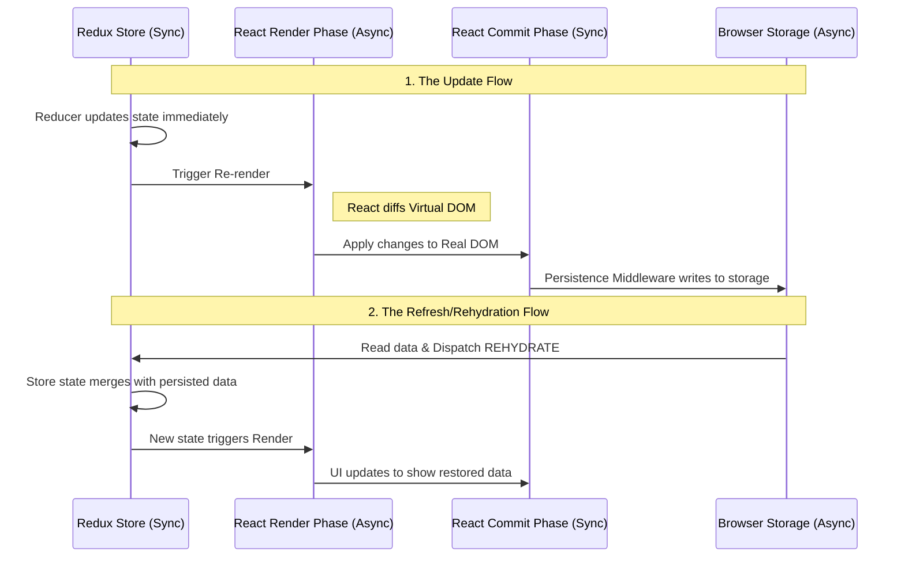

# State Management & Persistence: useState vs. Redux (0-100)

This guide deep-dives into React's core state management (`useState`) and advanced global state solutions like Redux, specifically addressing how data persists (or doesn't) across page refreshes. We'll uncover React's rendering mechanics and how they interact with external state and browser storage.

## `useState`: Local & Ephemeral State

At its simplest, `useState` manages component-local state. It's perfect for UI-specific data that doesn't need to be shared widely or survive page refreshes.

- **Pros:** Simple, direct, no boilerplate.
- **Cons:** State is lost when the component unmounts or the page refreshes. Not suitable for global or persistent data without manual browser storage integration.

For application-wide or persistent state, more robust solutions are needed. This is where Redux often comes into play, bringing its own set of interactions with React's lifecycle and persistence strategies.

---

## 1. The React Lifecycle: Render vs. Commit

React processes state changes through two distinct phases:

| Phase               | Nature                  | What happens?                                                                                                      |
| :------------------ | :---------------------- | :----------------------------------------------------------------------------------------------------------------- |
| **1. Render Phase** | **Asynchronous / Pure** | React calls components to determine what _should_ change (Virtual DOM diffing). **Can pause/restart.**             |
| **2. Commit Phase** | **Synchronous**         | React applies actual changes to the real DOM (insert, update, delete). Never interrupted to ensure UI consistency. |

### Why React feels "Async":

Even if Redux updates state **synchronously**, React might **batch** multiple updates, delaying the Render phase for performance. This explains why `console.log(state)` after dispatch sometimes shows the _old_ value.

---

## 2. Updated End-to-End Flow (with Phases)

This diagram illustrates a Redux action's journey through React's Render/Commit phases and eventual disk persistence.

---

## 3. The "Sync vs Async" Conflict Explained

1.  **Redux is Synchronous:** Dispatched actions immediately update the store's state.
2.  **React is "Scheduled" (Async):** React receives state change signals but may **batch** updates, delaying the Render phase for performance.
3.  **Persistence is a Side-Effect:** Writing to `localStorage` happens _after_ Redux updates. Data might not hit disk instantly.

---

## 4. Internal Mechanics: What happens on Refresh?

### Step A: The Wipe (Browser Level)

1.  User refreshes page.
2.  Browser clears **all JS Heap Memory** (React, Redux state are destroyed).

### Step B: The Boot (Code Level)

1.  HTML/JS loads.
2.  Redux Store initializes with **initialState**.
3.  `redux-persist` (or custom code) triggers an **Async Read** from `localStorage`.

### Step C: The Rehydration (The Gap)

1.  Persisted data is fetched from disk.
2.  A `REHYDRATE` action is dispatched to Redux.
3.  **React Render/Commit:** React updates the UI to show the restored session.

---

## 5. Edge Cases: Render & Persistence

### 1. The "Flicker" (Hydration Mismatch)

React's Commit Phase completes _before_ Rehydration finishes, showing an "empty" UI momentarily.

- **Fix:** Use `PersistGate` to block React's Commit Phase until disk-read is complete.

### 2. The "Zombie" State

Updating state during React's Commit Phase (e.g., `useLayoutEffect`) can cause double-writes to storage.

- **Fix:** Configure persistence middleware to "debounce" writes, preventing excessive I/O.

### 3. Non-Serializable "Gaps"

`JSON.stringify` (for persistence) deletes functions/symbols and converts complex objects (like `Date()`) to strings. Rehydration won't restore original object types.

- **Example:** `Date()` saved as string, used as `state.date.toISOString()` after rehydration, crashes.
- **Fix:** Implement rehydration transforms to convert data back to original object types.

---

## 6. Real-World Architecture (Next.js SSR Specific)

In SSR, the **Render Phase** happens on the Server, but **Disk (localStorage)** is client-only.

1.  **Server Render:** React renders with "Initial State" (e.g., `loading: true`).
2.  **Client Hydration:** React takes over DOM.
3.  **Rehydration:** `redux-persist` reads disk, updates state.
4.  **Second Render:** React renders with "Actual State."

**Warning:** This can cause a "Hydration Error" if Server HTML differs from Client HTML.

- **Solution:** Use `useEffect` to ensure persistence logic runs _only after_ the first client-side commit, avoiding server/client mismatch.

## 7. Summary

React state (`useState`) lives in **volatile memory**, lost on refresh. For persistence, Redux (a **synchronous state machine**) can be used, but interacts with React's two-phase system: **Render (async/diffing)** and **Commit (sync/DOM updates)**. Persistence mechanisms intercept Redux updates, writing state to **permanent browser storage**. On refresh, we block React's **Commit Phase** (via a gate like `PersistGate`) until data is rehydrated into Redux, ensuring a seamless, flicker-free persistent experience.
